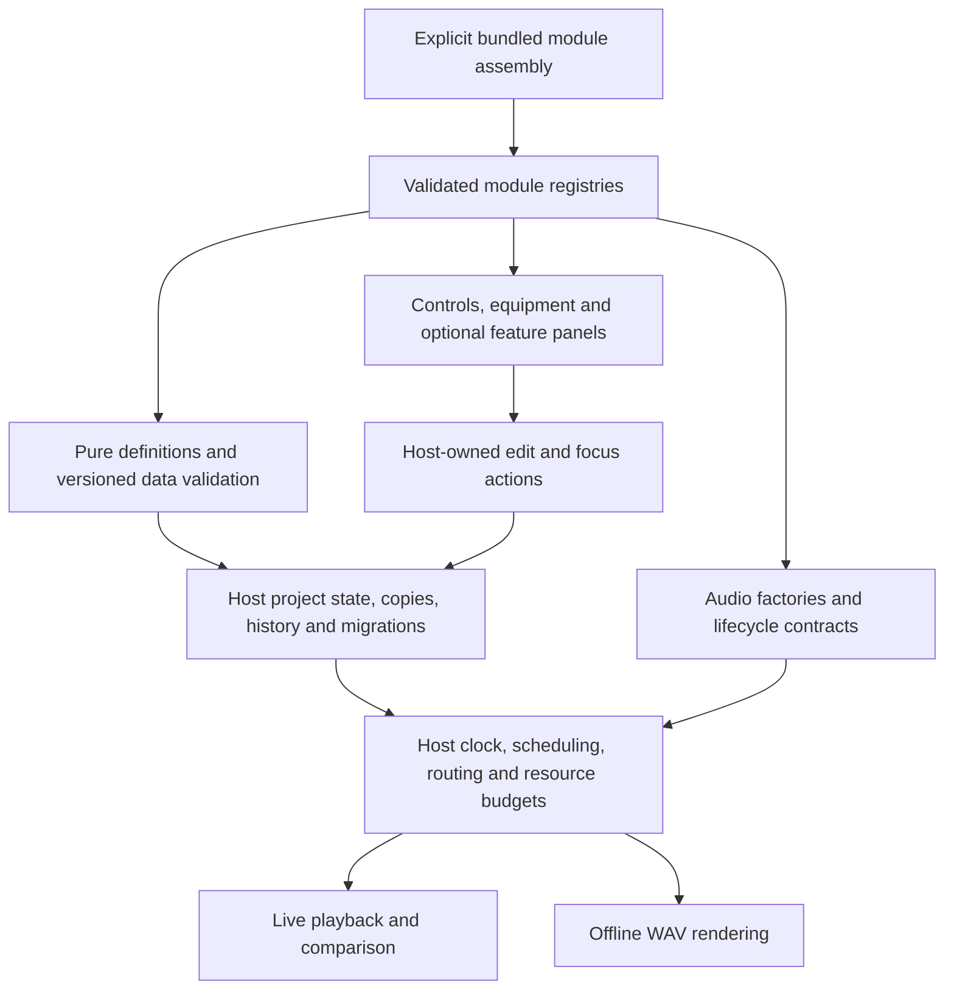

# Modular FourPataka architecture

Status: major requested program of six separate milestones, planned and not implemented. The current application is v0.19.3. These are design requirements, not an available plugin SDK. The milestone sequence and acceptance gates are in [BUILD_PLAN.md](../../BUILD_PLAN.md#14-modularity-and-open-source-contributions).

## Intended contributor experience

A contributor should add a module directory, implement a documented contract, provide tests and examples, and register it in one explicit build assembly. Equipment discovery, controls, validation, owned copies, project files and live/WAV rendering should consume that registration without another pedal-kind switch or edits across unrelated views. Built-in modules must use exactly the same contracts as contributed modules.

Start with reviewed TypeScript modules bundled from source. An installed-package loader, marketplace, automatic downloads and executable project attachments are separate future proposals. A project file contains data and module requirements, never executable code. Bundled modules run within the application; they are not individually isolated from each other. The existing Electron renderer sandbox is not a sandbox for arbitrary extensions.

## Current integration points

- [pedals.ts](../../src/core/pedals.ts) defines a four-kind union, labels, numeric controls, defaults, parameter validation and chain settings. This is useful shared metadata but not a general registry.
- [effects.ts](../../src/audio/effects.ts) branches on kinds to build processors and calculate latency. Its `EffectGraph` already exposes input/output, latency, tail, tail activity, update and disposal.
- [PedalBoardSurface.tsx](../../src/components/PedalBoardSurface.tsx) lists equipment and accepts drag payload kinds explicitly. [PedalControls.tsx](../../src/components/PedalControls.tsx) uses shared controls but special-cases EQ labels/reset.
- [export.ts](../../src/audio/export.ts) has a delay-specific routed-tail estimate. [scoreGraph.ts](../../src/audio/scoreGraph.ts) shares routing between playback and export and aligns track processing latency before the master chain.
- [project.ts](../../src/core/project.ts) creates the factory instrument library, validates a fixed `Sound` and owns preset/application reconciliation. [instrumentPresets.ts](../../src/core/instrumentPresets.ts) supplies Soft bass and its conservative template upgrade.
- [music.ts](../../src/core/music.ts), [voice.ts](../../src/audio/voice.ts) and [waveform.ts](../../src/core/waveform.ts) implement the current 16-harmonic Fourier model. Adding a named preset is different from adding a new synthesis engine.
- [App.tsx](../../src/App.tsx) combines project state, workflows and views. [commands.ts](../../src/core/commands.ts) separates documentation metadata from parser semantics, including blank autocomplete templates.

These seams must be migrated incrementally. Existing shared factories, independent copies and phase/clock policies are foundations to preserve, not implementations to discard.

## Proposed boundaries

Proposed organization, with names subject to the first contract review:

- `src/modules/contracts/`: typed definitions, parameter descriptors, audio lifecycle and module-data envelopes; no React or Electron dependency in data/audio contracts.
- `src/modules/registry.ts`: explicit, validated assembly with duplicate-ID/version failures and deterministic ordering.
- `src/modules/builtins/pedals/<id>/`: definition, DSP factory, focused tests and optional custom inspector.
- `src/modules/builtins/instruments/<id>/`: Fourier preset definitions first; new engine implementations only after milestone M4 (voice contracts).
- `src/modules/features/<id>/`: optional panels, experiments or commands through host actions; no alternate authority over score text.
- `src/audio/`, `src/core/` and desktop bridges: host services for timing, persistence, routing, export and trusted native operations.
- `examples/modules/`: small compiled contributor examples that exercise the real contracts. Example-only equipment is not automatically part of the default application.

Directory moves alone do not satisfy modularity. Avoid a circular dependency in which the registry imports host state while the host imports the registry. Pure definitions are the shared lower layer; factories and React adapters are separate consumers. Enforce these import boundaries with checks when implemented.

## Required contracts

Every definition needs a stable namespaced module/type ID, a module API version, an independent saved-data version, display metadata, defaults, pure validation/migration, capabilities and source/license attribution. Module IDs and score-library keys are different: existing `using`/`through` keys retain their current grammar and meaning.

Numeric parameter descriptors need key, label, default, minimum/maximum, step, unit, display/linear-or-log mapping, normalization and reset semantics. The same descriptor must govern compact dials, exact values, validation and documentation. Add nonnumeric parameter types only with corresponding import/control tests. Explicitly distinguish continuous updates from changes that rebuild topology.

Audio factories must work with live and offline contexts. Their contract must cover gain/mix/bypass, measured processing latency in seconds, conservative finite tail bounds, tail activity, updates, cleanup and resource estimates. The host supplies the session time origin, note start and deterministic seed where needed; modules must not schedule against wall-clock time. Declared capabilities must honestly distinguish in-place updates, warmed crossfades and replay-only changes.

Each module owns fresh runtime nodes, phase and buffers per applied instance. Serializable settings are independent data copies; modules never share mutable DSP state through the preset library. The host owns score revisions, voice admission, routing, latency alignment, hard Stop, project mix and monitor exclusion from export.

Definitions are immutable; factories return owned disposable instances. Runtime registration must fail clearly for duplicate IDs, incompatible APIs or invalid definitions before an affected audio graph starts. Unsupported saved modules have a separate preservation workflow in [compatibility](COMPATIBILITY.md); do not conflate malformed input with an unavailable implementation.

## Public surface and documentation

Use one documented public import entry point and version its contracts. Contributors should not import private host files. Keep source examples, API comments, units, contract checks and tutorials beside the implementation. A tutorial is complete only when it builds and passes from a clean checkout; it must identify its supported API version and work in browser and portable workflows where claimed.

The first supported contribution paths are [pedals](PEDALS.md) and [Fourier instruments](INSTRUMENTS.md). [Feature modules](FEATURE_MODULES.md) cover the later panel/experiment/command boundaries. [CONTRIBUTING.md](../../CONTRIBUTING.md) describes the working source contribution path available today.

## Proof of completion

Migrate all four built-in pedals through the same registry before declaring the pedal API usable. Add a small independent example using only the public contract and one assembly entry. Then do the equivalent for instrument presets, followed by the voice capability contract and optional feature modules. Verify schema-v1 projects, copy ownership, phase/clock continuity, measured latency, bypass/tails/Stop, source/history and shared live/offline output throughout.

Publication readiness additionally needs an owner-approved open-source license, attribution review, maintained contribution/review guidance and repeatable CI. No license is selected by this plan, and no publishing settings are changed. Milestones M1 (contracts), M2 (pedals), M3 (presets), M4 (engines), M5 (features) and M6 (open-source readiness) each have their own release, documentation and proof gates. M2/M3 enable useful contributions without waiting for all six. A visibly working module plus maintained contributor documentation is a milestone gate, not an optional polish task.
