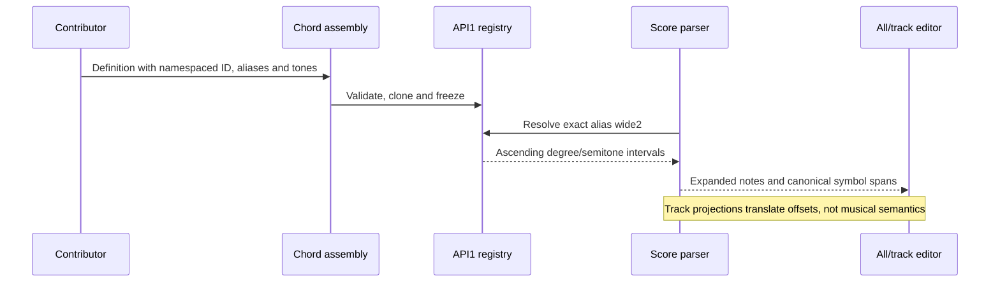

# Contributing chord shapes (implemented pilot)

This is the first implemented notation contribution contract. General pedal, preset, engine and feature APIs remain planned in [the milestone plan](../../BUILD_PLAN.md#14-modularity-and-open-source-contributions). Definitions are reviewed source bundled with the application; project files do not load executable plugins.

## Add a shape

1. Create a definition under `src/modules/chords/` and import the `ChordShape` type from the public entry `src/modules/chords/index.ts`.
2. Give it a unique namespaced `id`, `apiVersion: 1`, label, exact case-sensitive aliases and ascending `tones`. Register it in the explicit assembly in `src/modules/chords/index.ts`.
3. Follow the shipped [open-fifth example](../../src/modules/chords/examples/openFifth.ts). Its alias `open5` makes `chord:Copen5@3 quarter` expand to C3 G3 C4 without any parser or audio special case.
4. Add registry/expansion tests, then run `npm test`, `npm run build` and the synthesis-notation browser test. Regenerate/check project knowledge after updating feature documentation.

```ts
import type { ChordShape } from '../index';
export const MY_SHAPE: ChordShape = {
  id: 'example:open-fifth',
  apiVersion: 1,
  label: 'Open fifth with octave',
  aliases: ['open5'],
  tones: [
    { degree: 0, semitones: 0 },
    { degree: 4, semitones: 7 },
    { degree: 7, semitones: 12 },
  ],
};
```

`degree` counts diatonic steps from zero: root 0, third 2, fifth 4, octave 7, ninth 8, thirteenth 12. `semitones` is the compound chromatic offset from the root. Values must be integers, degrees 0–28, offsets 0–48, with strictly ascending offsets starting at `{degree:0,semitones:0}`. A tone may differ by at most two semitones from its natural degree. Shapes have 1–32 tones and 1–16 aliases; the registry accepts at most 256 definitions. IDs, labels and aliases are bounded and duplicates/API mismatches reject registration. The registry clones and freezes definitions; neither callers nor returned records can change registered behavior.

## Score behavior

`chord:Cmaj13#11 quarter` uses root octave 4. `chord:Cmaj13#11@3 quarter` produces C3 E3 G3 B3 D4 F#4 A4. These are full ascending stacks, with no automatic omissions, inversions, slash bass or arbitrary alteration grammar. Only registered aliases are valid; `m` and `M` remain distinct. The major-thirteenth sharp-eleventh intervals follow the standard 1, 3, 5, 7, 9, #11, 13 pattern ([Tonal chord dictionary](https://github.com/tonaljs/tonal/blob/main/packages/chord-type/data.ts)).

Degree spelling uses natural notes and single accidentals. Where a double accidental is required, the current pitch grammar uses an enharmonic single-accidental equivalent. The complete voicing must resolve inside C0–B8 or parsing fails; notes are never silently dropped. Existing explicit `chord:(Bb D F)5` syntax keeps its original same-octave meaning.

Hover over a symbol or place the keyboard cursor inside it to see the compiled notes. Inspection does not change score text/history. Completion inserts `chord:@ ` with empty root/shape, octave and duration fields; F2/Shift+F2 move between fields; Tab indents. An explicitly chosen shape suggestion replaces only the suffix. Playback, timeline, comparison phrases and WAV consume the parser's ordinary expanded note events.

## Compatibility and limits

Project schema 2 stores source text and 32-partial sound banks, not chord executable definitions. Schema 1 imports preserve all 16 original coefficients/signs and pad silent upper partials independently. Storage/recovery keys remain stable. Unknown chord aliases remain in source, produce diagnostics and block playback/export; existing track copies are retained while the score is invalid. Removal or semantic alteration of an alias is a language compatibility change: keep old aliases/intervals stable and add a new shape/alias for a different voicing. API-version changes require explicit review; no runtime module discovery or unknown-pedal/engine preservation is claimed by this pilot.

## Illustrated assembly and second example

The [module creation walkthrough](MODULE_CREATION.md#walkthrough-the-wide-suspended-second-example) traces a complete reviewed definition through registry, compiler, both editor views, comparison and live/WAV factories. The shipped wideSecond.ts example registers wide2 as root/ninth/twelfth; chord:Cwide2@3 quarter expands to C3 D4 G4. It supplements open5 and follows the same API1 contract without modifying parser/voice branches.



When removing/changing a definition, test its old saved aliases explicitly. Registry removal never edits source to a different shape automatically. Unknown aliases produce diagnostics and block Play/WAV while retaining source and existing owned copies. A different voicing should get a new identity/alias rather than silently change familiar music. Contributor guides and tests must use the real assembly and public chord type, not a parallel test-only parser dictionary.
