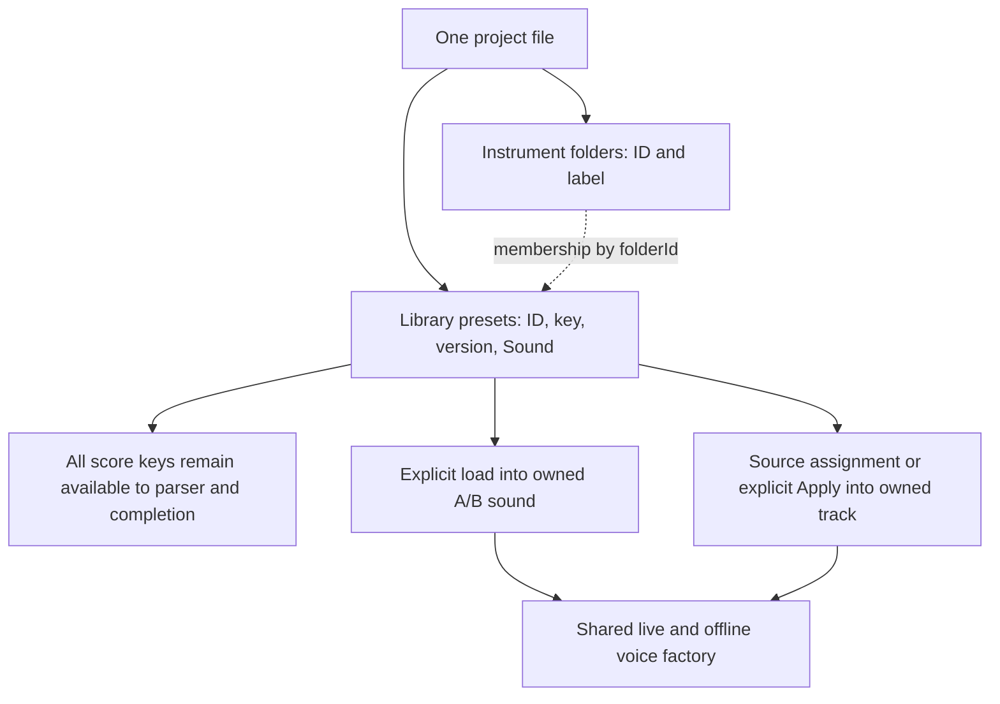
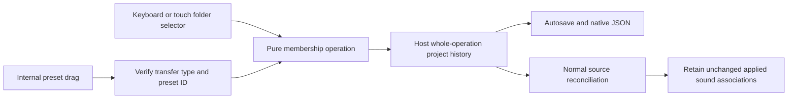

# Instrument library folders

Implemented in v0.26.0. Folders organize a project's preset library; they do not change synthesis, score syntax or the planned M3 preset-module API.

## Use the library

**Simple shapes** holds the factory Pure sine, Square, Sawtooth and Triangle presets. It starts collapsed so unfiled instruments and your own saved presets have more space. Click its arrow to open it. Folder headers show the instrument count and indicate when the selected preset is inside.

Use the folder-plus button beside **Instrument library** to create a folder. Type a name and press Enter. The pencil renames it; the trash button removes the folder and returns every member to Unfiled. It never deletes an instrument. Names are unique without regard to case, contain 1–100 characters, and are independent of score keys. A project supports up to 32 folders, with the existing 128-preset limit unchanged. Escape cancels an inline edit and returns focus to its trigger.

Drag a preset onto a folder header, including a closed folder, to move it. Drag it onto **Unfiled** to move it out. The highlighted drop target confirms the destination. A preset can belong to one folder or none; nested folders and manual ordering are not part of this release. Members retain their existing library order. New folders open immediately; saved folders begin collapsed on reload. Disclosure is local view state and creates no project undo entry.

The **Library folder** selector in Instrument provides the same move for keyboard/touch input and narrow layouts where the sidebar is hidden. New presets saved with **Save as new** start unfiled, even when their source preset is grouped. Folder create/rename/remove and each membership move are separate whole-operation Undo/Redo actions. Merely organizing a sound does not select it, reapply it, restart an audition, or edit the score.

## Saved data and ownership

The existing schema-2 project gains optional `instrumentFolders: [{ id, label }]`; each library preset gains an optional `folderId`. Folder IDs live in their own namespace. Preset IDs, score keys, template versions and `Sound` settings retain their existing meanings. Track instances and comparison A/B sounds carry no folder membership.

Grouping updates only library organization; it never copies a library `Sound` into an applied instance. Renaming a folder is unrelated to renaming a score track. Removing a folder clears its members' `folderId`, retaining the same preset ID/key/version/Sound. Playback keeps its frozen score revision and audio clock; no folder-specific parser or audio branch exists. Presets inside closed folders are still available in Track Maker, assignment selectors, score completion and export.

New projects and older files without the folder field seed **Simple shapes** for recognized factory IDs/keys only (`sine`, `square`, `saw`, `triangle`). Edited factory timbres remain edited. An explicit empty folder array means the user chose no folders and is never reseeded. A custom preset that happens to use one of those keys under a different ID is left unfiled. Schema-1 sounds still migrate to 32 harmonics independently before organization is added. Existing bundled percussion availability remains unchanged; the three percussion presets start unfiled.

Import validates folder count, unique bounded IDs/names and every membership reference before replacing the current project. Unknown folder metadata is omitted from the clean object; dangling references and malformed metadata reject the file. Local save, recovery, native JSON and export snapshots retain the organization. Canonicalizing a legacy project does not consume the previous distinct recovery checkpoint. Older application versions that do not know the optional fields can discard organization when resaving, so use v0.26.0 or newer for folder-aware editing.

## Source integration

[instrumentFolders.ts](../../src/core/instrumentFolders.ts) owns pure folder operations, default seeding and metadata validation. [project.ts](../../src/core/project.ts) validates/imports memberships and seeds absent legacy organization. [InstrumentLibrary.tsx](../../src/components/InstrumentLibrary.tsx) owns inline form, disclosure/focus and drag state. [App.tsx](../../src/App.tsx) retains project/history ownership, preset loading and audio workflows.

The drag payload uses `application/x-fourpataka-instrument` and the stable preset ID. The view accepts only a matching drag started in the current library, checks that the preset still exists, and lets the core operation validate the destination. External text/files are not preset moves. Dropping on the current folder is a no-op with no new history entry. Pointer drag does not call preset selection; the keyboard fallback likewise changes membership only.

Future preset modules should supply fresh sound factories and project identity through the eventual M3 contract, leaving folders as host-owned presentation metadata. Do not derive synthesis, capabilities, parser validity or preset upgrades from a folder label. The current illustrated recipes remain source contributions, not a runtime loader or public SDK.

## Verification

Run `npm test -- tests/unit/instrumentFolders.test.ts`, then `npx playwright test tests/browser/instrument-folders.spec.ts`. The packaged workflow is `npx playwright test --config playwright.desktop.config.ts --grep "packaged instrument folders"` against the newly packaged executable.

Unit proofs cover immutable operations, copy/source identity, no-op history, bounds, migration, explicit empty folders and import rejection/whitelisting. Browser/native workflows use real pointer drags into open/closed folders and Unfiled, undo/redo, keyboard movement, rename/delete, autosave/reload and native JSON saving/opening. A running audition test verifies that a folder move leaves its clock running. Existing preset sign, percussion, keyboard, recovery and source/application checks expand Simple shapes before choosing a basic waveform. Physical trackpad/touch and screen-reader evaluation remain distinct manual checks.

Continue with [instrument contributions](INSTRUMENTS.md), [preset factories](PERCUSSION_PRESETS.md) and [compatibility](COMPATIBILITY.md).
