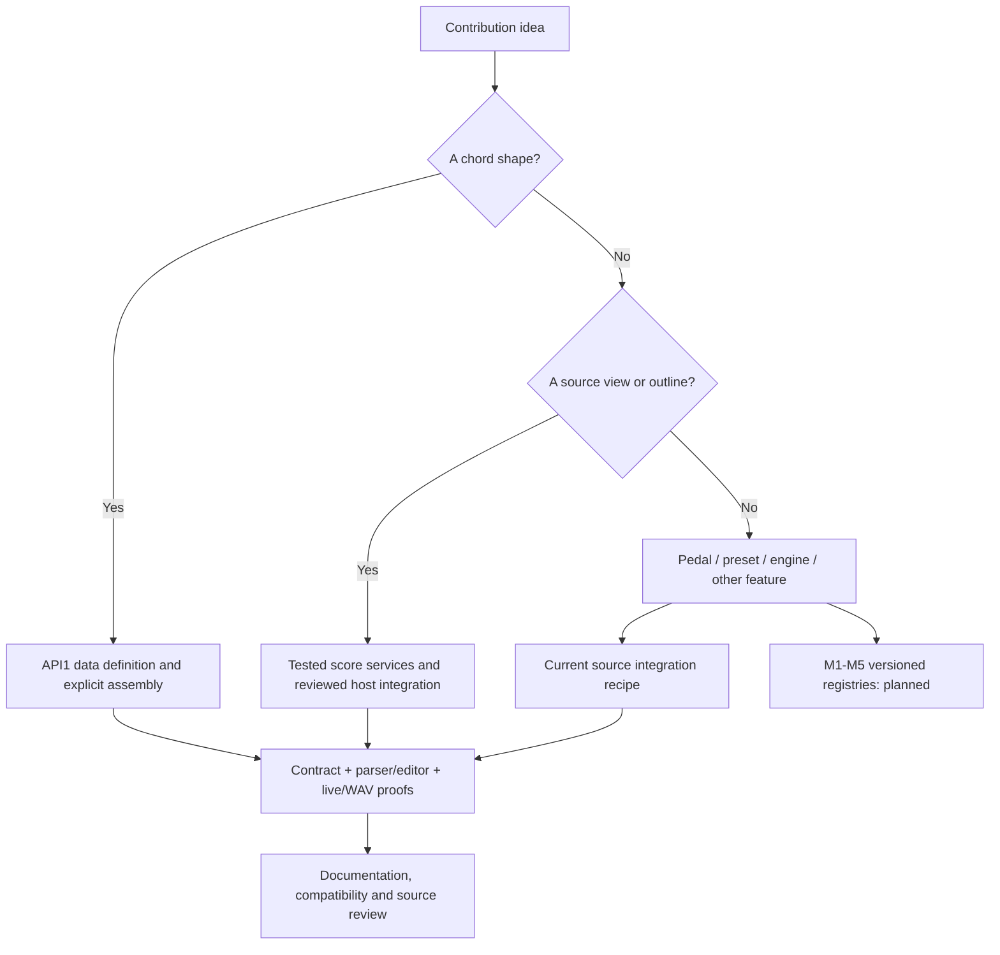
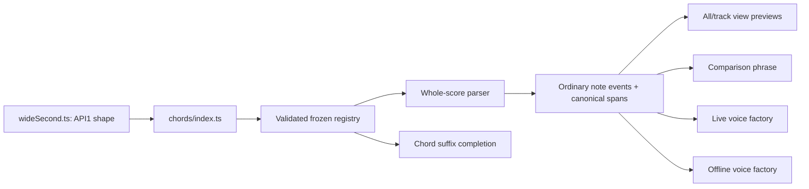
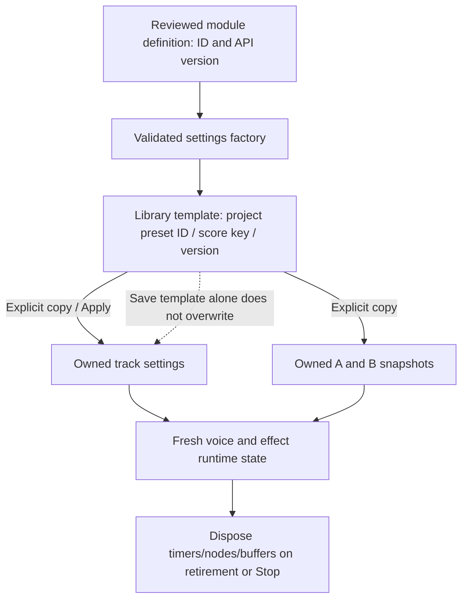
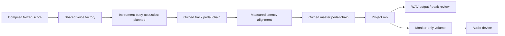
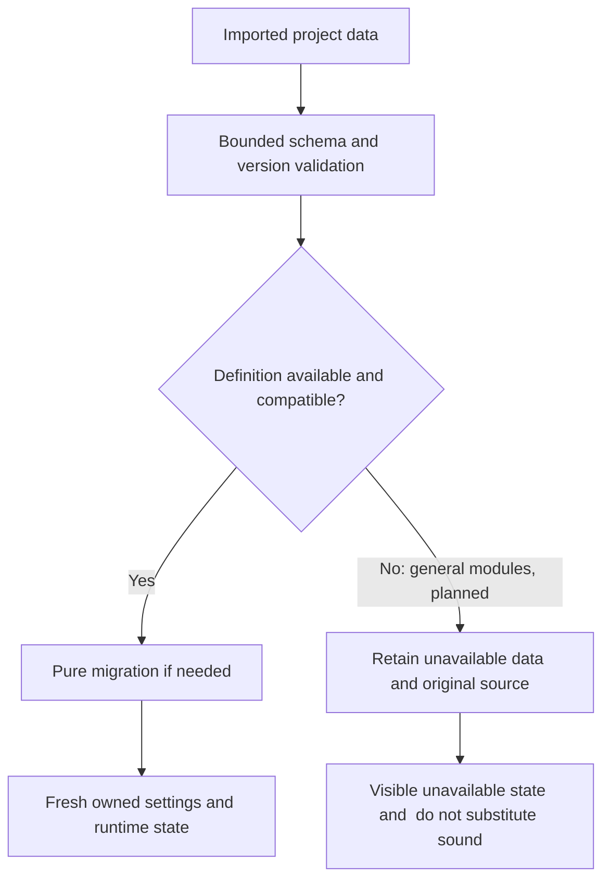

# Creating a FourPataka module

This guide distinguishes working source contracts from planned registries. It is not an installer, marketplace or a released general SDK. The repository has no approved open-source license yet; owner-approved licensing/attribution remains a publication gate. You can prepare reviewed source contributions and run the existing examples without claiming that those future gates are complete.

## Choose an implemented seam first

The chord-shape API is the current versioned contribution contract: API1 definitions, an immutable validated registry, explicit assembly and shared parser/editor/playback consumers. The score workspace adds tested source-view services in v0.24.0; their public M5 contract is still provisional. Pedals, Fourier presets, synthesis engines and optional feature registries are planned M1–M5 work. Their current source recipes are linked below and require host integration today.



Use [CHORD_SHAPES.md](CHORD_SHAPES.md) for working shape imports/limits, [SCORE_VIEWS.md](SCORE_VIEWS.md) for canonical views, [PEDALS.md](PEDALS.md) for current DSP integration, [INSTRUMENTS.md](INSTRUMENTS.md) for presets/engines and [FEATURE_MODULES.md](FEATURE_MODULES.md) for panels/commands. The [architecture](ARCHITECTURE.md) and [compatibility](COMPATIBILITY.md) guides define the broader planned boundaries.

## Walkthrough: the wide suspended-second example

The bundled example is src/modules/chords/examples/wideSecond.ts. Its namespaced identity is example:wide-second; its alias is wide2. It stacks a root, ninth and twelfth, so chord:Cwide2@3 quarter expands to C3 D4 G4. This adds no parser/audio special case and demonstrates compound degree spelling.

1. **Define data.** Import CHORD_SHAPE_API_VERSION and ChordShape from ../contracts within the example folder. Supply an immutable ID, API version, label, exact aliases and ascending degree/semitone offsets. Namespaces identify a definition; score aliases identify notation. Keep those roles separate.
2. **Register explicitly.** Import the definition in src/modules/chords/index.ts and include it once in the existing createChordShapeRegistry assembly. Runtime code is bundled/reviewed by the owner. Project JSON never evaluates a definition or downloads executable code.
3. **Reject collisions at assembly.** Duplicate IDs/aliases, unsupported API versions, invalid spelling/interval limits and unsorted tones fail registration. Do not silently let the last plugin override a familiar alias. Registry-owned frozen copies prevent later mutation of caller objects.
4. **Exercise all consumers.** The parser expands the symbol to ordinary events once. Editor chord previews/completion, track views, comparison, live voices and WAV consume that expansion. Invalid roots/octaves or unavailable aliases diagnose rather than drop notes or choose a substitute.
5. **Prove compatibility.** Existing aliases retain the same exact intervals. A new voicing needs a new alias/definition. Saved source remains the authority; new module data does not overwrite old applied instruments or pedal chains.



Run from a checkout with npm dependencies and supported Chrome installed:

```sh
npm ci
npm test -- tests/unit/chordShapes.test.ts tests/unit/chordSymbols.test.ts
npm run build
npx playwright test tests/browser/synthesis-notation.spec.ts tests/browser/score-workspace.spec.ts
npm run knowledge:build
npm run knowledge:check
```

Then open Compose and write a track using a saved instrument:

```text
track example using sine {
  chord:Cwide2@3 quarter
  chord:Fwide2@3 quarter
}
```

Hover or move the cursor inside the first symbol: expect C3, D4, G4. Open its track tab: the same expansion must appear with local editor coordinates but canonical saved source. Play and export WAV: both tracks/settings and the same frequencies/gates remain. JSON export stores notation and owned project settings, not the executable definition. An absent wide2 definition on another build must report an unknown shape, preserving the text.

## Design metadata, musical data and runtime state separately



This ownership diagram also describes the obligations for future M2/M3/M4 modules, not implemented discovery APIs. Parameters have explicit units and bounds. A preset version is not a module API version; a score key is not a stable module ID. A library update requires an explicit application scope. A module factory cannot capture shared mutable coefficients, delay buffers, envelopes or oscillator state across voices/instances.

## Current and planned audio contribution path

For a pedal today, edits still reach the pedal catalog/schema, controls/equipment, DSP factory, validation/import and live/WAV resource estimates. The M2 goal is one definition/assembly entry replacing those host switches; it has not shipped yet. For a Fourier preset, follow the existing factory/library migration recipe. A different synthesis algorithm must wait for or help build the explicit M4 voice contract, rather than pretending to be Fourier coefficients.



The body-acoustics box is a planned location; there is no chamber effect in this release. Current voices feed track chains directly. Pedal reverb is a separate planned chain effect. Live and offline renderers must share factories; a module does not get its own sequencer. Declare latency in seconds, tail bounds in seconds, gain reference, supported sample rates and update behavior. Hard Stop clears voices and buffers; bypass policy must state what happens to existing tails. See the effect-specific requirements in the pedal guide.

## Compatibility review before adding saved settings



The unavailable-data branch is an M1 compatibility requirement, not implemented support for arbitrary pedal/engine modules. Chords already preserve unknown aliases in source and block invalid playback. Do not save a new pedal/engine type until validation, migration and missing-definition handling exist together. Keep migrations deterministic and independent of audio/hardware/UI. Validate resource bounds before allocating long offline renders. Compare old/current schemas, duplicate IDs, unsafe values and future unsupported versions.

## Feature and source-view contributions

The current source workspace is a concrete model for host-owned features. Read a canonical snapshot, project a span, return a guarded action, let the host record history/reconcile copies, and compile the whole score. Metadata alone cannot add language semantics. New notation must implement lexer/parser bounds, canonical diagnostics/spans, editor/reference/completion, source editing and playback/export equivalence. Named sections and swing remain future parser milestones.

Do not publish a generic setProject callback or mutable project object as an extension API. Feature selection/focus/scroll is UI state; musical changes are explicit history actions. A module does not own native file dialogs, unrestricted filesystem access, an independent AudioContext or a second timeline clock. The planned M5 services will formalize these current invariants.

## Documentation and review deliverables

A useful module change includes a copyable example, actual supported import paths/API/data versions, a diagram of its host integration, parameter units/defaults/bounds, ownership and lifecycle behavior, removal/unknown-definition behavior and focused verification commands. Explain where code must change today and what planned registries would later replace. Include a before/after score or setting, expected expansion/audio behavior, and an old-project compatibility fixture.

Distinguish deterministic checks from device/listening/screen-reader evidence. Document actual skipped checks rather than mark all gates complete. Update the guide, BUILD_PLAN.md / IMPLEMENTATION_STATUS.md when gates change, features.json / DECISIONS.md, and regenerated PROJECT_MAP.md. Never commit local editor/agent instructions, model/vector caches, generated releases or test profiles. Contribution licensing and dependency/asset attribution remain required owner decisions before an open-source publication.

## Troubleshooting

- **Registration rejects an alias:** check duplicate spelling/case and identifier bounds. Do not suppress the error or use an override order.
- **The card exists but notation fails:** command metadata documents syntax; the compiler owns semantics. Add the actual parser contract/proofs.
- **A track resets after rename:** move owned track/chain identity before reconciliation. Do not look up a new library template by the visual tab index.
- **Hover points to the wrong text:** translate canonical UTF-16 offsets through the CRLF-aware projection, not just subtract a row number.
- **WAV differs from live playback:** inspect shared factories, frozen applied copies, latency padding, randomness and tail budgets. Monitor volume is not export gain.
- **A change clicks or replays a phrase:** document phase/update capabilities and preserve the host clock. Do not label oscillator restart as phase continuity.
- **A contributor cannot build the example:** replace planned import names with real paths, keep runtime assets local/packaged and verify from a clean checkout.

See [CONTRIBUTING.md](../../CONTRIBUTING.md) for environment/review workflow and [extension index](README.md) for category status. These diagrams describe implemented invariants or explicitly labeled planned boundaries; they do not announce a public SDK release.
