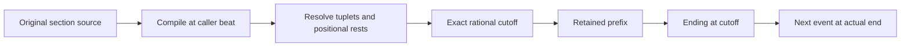
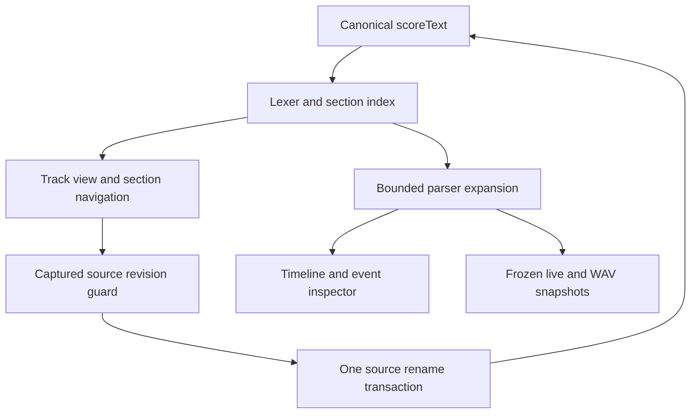
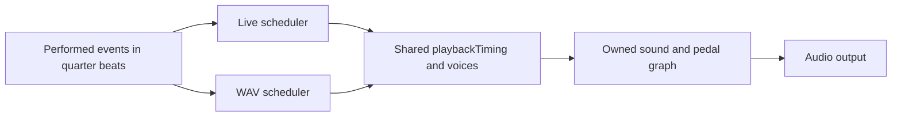

# Named sections and alternate endings

Implemented in v0.27.0. Sections belong to a track and live in the same saved score as track tabs. A declaration consumes no time and schedules no music. Use `play` wherever you want it performed. These are current source services; the general M5 feature-module registry is still planned.

## Write a passage once

```text
tempo 120
time 4/4
track melody using sine {
  section A {
    legato[
      chord:Cmaj13#11 quarter
      D4 quarter
    ]
    triplet[
      E4 eighth
      F4 eighth
      G4 eighth
    ]
    rest bar
  }
  play A
  play A trim 1 {
    A4 quarter
    G4 quarter
  }
}
```

The first call lasts four quarter-note beats. The second retains three beats and appends two, lasting five. The track therefore lasts nine beats (4.5 seconds at 120 BPM). Merely declaring A produces zero events. Headers `section A {`, `play A`, and `play A trim ... {` occupy their own lines; music goes on following lines. Comments after headers work. Existing inline repeat/bracket syntax remains compatible.

Names start with a letter and contain letters, digits or underscores, up to 100 characters. They are case-sensitive. Define sections directly in the track body, outside other sections, repeats, tuplets and articulation groups. Forward calls work. Another track may independently define A; cross-track calls are not supported. Sections cannot assign instruments, pedals, tempo, meter or master routing.

Use existing `repeat 3 {` blocks around calls to play a section three times. `play A trim 1` omits a tail without adding an ending; `play A { ... }` appends an ending without cutting. `play A trim 0` preserves the original performed body. Expressions accept numbers, parentheses and `+ - * /`, following the existing bounded timing grammar; trim always measures quarter-note beats after enclosing tuplet scaling. It does not count notes or bars.

## How cutting works

Each invocation recompiles the original body at its actual position. `rest bar` therefore aligns with the current global meter, including meter changes. Calculate the full performed body before subtracting the requested tail. Remove events beginning at or after the cutoff. Shorten a note, chord or rest crossing it; retain its pitches, source span and attack. No split note or extra onset is created.



For a two-beat chord followed by a one-beat rest, `trim 1.5` removes the rest and the last half beat of the chord. Its performed duration becomes 1.5 beats. A full-length cut removes the entire body and starts the ending immediately. Empty sections accept only a zero cut. Negative, non-finite, above-one-million-beat and longer-than-body cuts diagnose instead of clamping.

Shortened staccato uses half its new duration for the gate. Existing articulation timing then supplies the bounded release. Internal legato groups stay local to each invocation; an explicit surrounding legato group can connect calls and their endings. Enclosing tuplets/articulation apply to the called body and the ending. Ending length can differ from the removed tail; there is no implicit padding to synchronize parallel tracks.

Nested calls retain a provenance chain. An outer cut can truncate or remove inner invocations: `clippedByParent` identifies shortened metadata, and actual duration/retained/ending lengths reflect the surviving interval. Original duration and the requested trim remain available for explanation. A call-site ending may explicitly call the same section again; self/mutual recursion through section definitions diagnoses.

## Source editing and inspection

The Section selector lists the active track's definitions, or every track in All score. Go to section opens the owning track view and selects its name. Rename updates the definition and actual calls only in that track. Comments, other tracks, CRLF and surrounding source remain intact. One host history operation covers the whole rename; undo/redo works across track tabs.



The command reference chooses a local section for `play` cards. A new declaration receives an unused name, such as A2; an ending card starts with `trim 0` so insertion is valid for short or empty sections. IDE completion after `play` offers local names. Chord keyboard/hover previews are source-owned and remain available in unused definitions and trimmed-away notes, without scheduling them. A source span is previewed once even when called repeatedly.

The event inspector shows definition line, call line, actual call duration, requested cut and ending length. Timeline events show their section chain. Playing events highlight the definition line and all call lines. Diagnostic messages preserve the original failing span and show the call chain; do not flatten source to create diagnostic coordinates. Edits during playback remain replay-only, and stale-source highlighting is suppressed. A/B changes the running sound while retaining its clock; source navigation and rename do not create or reassign owned sound/pedal copies.

Malformed structure keeps typed source and falls back to All score rather than guessing track boundaries. Rename requires complete, unambiguous structure and a matching captured source. It is disabled during score playback. Other section edits, including deletion, are ordinary source edits: leaving an unresolved call diagnoses. No generated passage buffer is saved.

## Contributor integration seams

| File | Current responsibility |
| --- | --- |
| `src/core/scoreLexer.ts` | Whole-line section/call headers, original UTF-16 name spans, typed delimiters |
| `src/core/scoreSections.ts` | Scoped definitions/references, delimiter map, revision-safe rename and local names |
| `src/core/parser.ts` | Declaration-only semantics, bounded expansion, performed events, call metadata and chord previews |
| `src/core/sectionTiming.ts` | BigInt rational comparison, subtraction and exact cutoff |
| `src/core/scoreTiming.ts` | Global timing scan excludes section/ending/repeat bodies |
| `src/core/scoreWorkspace.ts` | Nested braces cannot close a virtual track early; CRLF projection |
| `src/core/commands.ts` | Shared reference metadata and empty IDE snippet shells |
| `src/core/scoreTools.ts`, `commandReference.ts` | Contextual source insertion and valid previews |
| `src/components/SectionNavigator.tsx`, `ScoreWorkspace.tsx`, `ScoreEditor.tsx` | Guarded operations, navigation, completion and projected source annotations |

Add a new notation feature through these current seams only after specifying its timing and source ownership. The lexer recognizes syntax; it must never decide audio behavior. Preserve the original spans through expansion. Convert rational beats to numbers at the public scheduler/UI boundary, and never place BigInts in project JSON. Update command metadata, source indexing, compilation, reference insertion and projection together. A command card or syntax color alone does not implement a feature.



This feature needs no alternate live/WAV synthesis path. Both use the same shortened event and shared articulation/voice services. Retain session-relative oscillator phase, latency alignment in seconds, finite tails and hard Stop. Comparison edits must not mutate library templates or applied track copies. Source definitions and invocation metadata are derived from scoreText; schema2 and the project file remain unchanged.

## Bounds and proof

Allow at most 64 section definitions per track, 16 nested section calls, 16 nested repeats, 128 passes per repeat, 10,000 expanded calls, 10,000 events and 100,000 token visits. Work budgets include discarded tails and validation; trimming cannot bypass them. The raw index also bounds delimiter nesting. Invalid invocation expansion rolls back its events/time/metadata while retaining diagnostics.

Unused definitions are validated in scratch tracks at beat zero, sharing the work budget and producing no performed events/calls. Thus music errors, missing references and cycles are visible before a passage is used. Position-dependent trim validation for an unused template uses that scratch position; an actual call recompiles and validates at its real position. Always test positional rests at multiple invocation positions and meters.

Run `npm test`, `npm run build` and the affected Playwright section, workspace, rhythm, IDE, reference and export checks. Tests must cover silent declarations/forward calls; scope/rename/revision/CRLF; exact/full/fractional/mid-event cuts; rests/chords/dots/nested tuplets/repeats/articulation; metadata clipping; cycles and expansion bounds; declared chord previews; one-file save/import; frozen source and A/B continuity; finite live/WAV output at 44.1/48 kHz; keyboard/narrow/native and portable workflows. Keep the user's demo score intact and use explicit fixtures.

See [Score views](SCORE_VIEWS.md), [chord modules](CHORD_SHAPES.md) and [module creation](MODULE_CREATION.md) for existing services. Swing, chamber acoustics, additional pedals, general M1–M6 contracts and physical listening/device/screen-reader acceptance remain separate planned gates.
