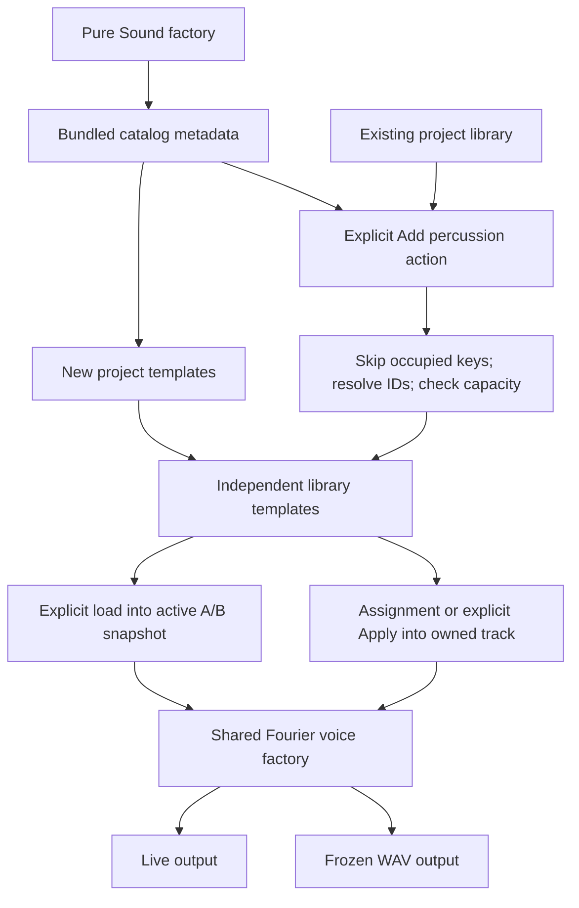
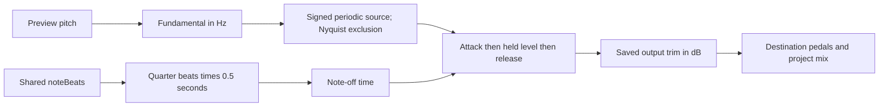

# Fourier percussion presets

The v0.25.0 source includes three editable percussion-inspired timbres: **Kick** (`kick`), **Closed hi-hat** (`hiHat`), and **Snare** (`snare`). They use the existing signed 32-harmonic Fourier engine. This is a bundled preset contribution, not completion of the planned M3 module API or M4 synthesis engines.

## Use them

New projects include the three presets. In an existing project, open Instrument and choose **Add percussion presets**. This is one undoable action. It adds only missing score keys, preserves customized presets with those keys, resolves colliding IDs, and rejects the entire import if it would exceed 128 templates. Starting the application does not silently add or replace library data.

Select a preset, choose **Use hit preview**, then **Listen**. The preview changes the shared comparison material's pitch and gate length, leaving the score and owned track sounds intact. The gate length selector in Comparison works for any note/chord audition; A and B use the same duration. Selecting another preset or switching A/B does not automatically change the material or restart its clock. Explicitly changing material/replaying starts a new audition.

- **Kick:** C2 preview, 62.5 ms gate, 5 ms attack, 160 ms release, −12 dB trim. A dominant low fundamental and six quieter partials provide body and a beater edge. Try C1–C2.
- **Closed hi-hat:** C4 preview, 31.25 ms gate, 5 ms attack, 35 ms release, −15 dB trim. Six sparse partials at H13/H17/H19/H23/H29/H31 provide a metallic tick. Try C4–C5.
- **Snare:** D3 preview, 62.5 ms gate, 5 ms attack, 90 ms release, −18 dB trim. A low four-partial body and dense H9–H32 bank provide a brighter rattle. Try C3–D3.

These are periodic electronic approximations. There is no random noise source, pitch drop or automatic decay after attack. Long written notes sustain until note-off; a short release alone does not shorten the held part. Use short notes, optionally with `staccato[...]`. Nyquist filtering can remove high partials at higher pitches/sample rates, while retaining their saved coefficients. More realistic noise/inharmonic sources and decay/pitch envelopes require separately planned synthesis work.

```text
tempo 120
time 4/4
track kickTrack using kick {
  staccato[
    C2 16th
    rest 8th
    C2 16th
  ]
}
track snareTrack using snare {
  rest 8th
  staccato[
    D3 16th
  ]
  rest 16th
}
track hatTrack using hiHat {
  repeat 4 {
    staccato[
      C4 16th
    ]
  }
}
```

This example is a separate test fixture; the owner's bundled demo is preserved.

## Extend the working source

See [instrumentPresets.ts](../../src/core/instrumentPresets.ts) for the pure factories and `PERCUSSION_PRESETS` metadata. Each call starts from a fresh mathematical preset and returns fresh magnitude/sign/undertone arrays. Never mutate an exported singleton `Sound`. A catalog entry has a unique ID/key, label, template version, factory, suggested pitch, quarter-beat gate and concise hint. This narrow bundled catalog is not a public runtime registry.

`createPercussionPresets()` creates owned templates. [project.ts](../../src/core/project.ts) uses it for new projects and the explicit `withPercussionPresets()` action. It does not run during project import. A/B snapshots and tracks deep-copy the selected library sound, and saving a newer library version still requires explicit Apply to change a track. Score `using` keys come from that project's library; the parser has no percussion-specific branch.



The comparison gate is optional `comparisonMaterial.noteBeats` in schema 2, bounded to 1/64–32 **quarter-note beats**. Omitted means the original 3.2 beats. Note/chord preview tempo remains 120 BPM, so seconds = beats × 0.5. Phrase comparison ignores this field and uses the score's timing. The UI displays milliseconds; factory metadata keeps the underlying beat unit. No `Sound` field or voice envelope equation changes.



## Verification recipe

Run `npm test -- tests/unit/instrumentPresets.test.ts tests/unit/comparison.test.ts`, then `npx playwright test tests/browser/percussion.spec.ts`. The native workflow is `npx playwright test --config playwright.desktop.config.ts --grep "packaged percussion"` against a freshly built/package-verified application.

Tests validate schema bounds, fresh banks, distinct spectral roles, and conservative explicit import (including collision/capacity behavior). The sum of magnitudes times trim gain bounds each source below 0.65 at any phase; this is a proof of factory headroom, not automatic normalization or a guarantee about arbitrary edited/polyphonic mixes. Offline voices verify finite nonzero output and silent tails at 44.1/48 kHz. Browser/native flows cover previews, source assignment, persistence and JSON; WAV verifies the frozen owned sounds and upper bank through the shared factory. Audible realism and physical-device response remain listening checks.

For broader module contracts and ownership diagrams, continue with [the instrument guide](INSTRUMENTS.md), [module creation](MODULE_CREATION.md), and [compatibility](COMPATIBILITY.md).
