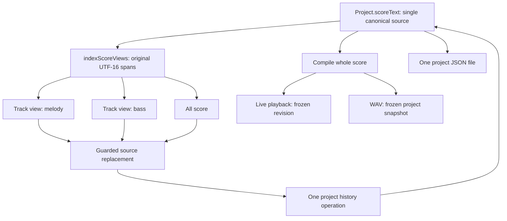
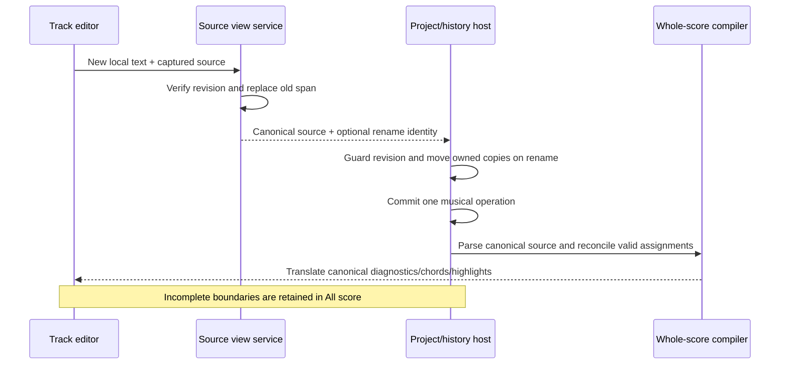
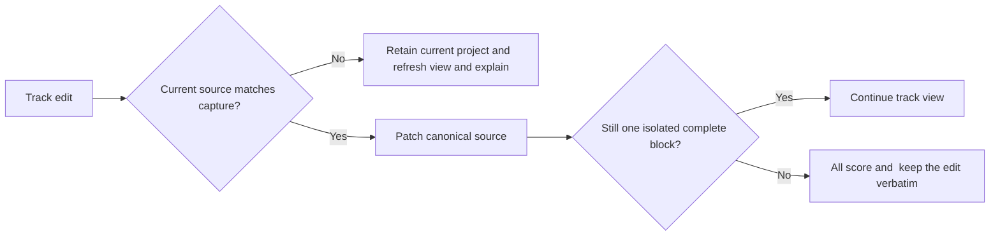

# Building on the score workspace

Status: shared-file track views are implemented in v0.24.0. The functions below are current source services with tests, not a versioned M5 plugin SDK. A feature contribution is still an explicit reviewed source change. Named sections/alternate endings and swing remain planned.

## One document, several views

All score displays the canonical project.scoreText. A track tab displays its header and complete block, including nested repeat/articulation/tuplet scopes. Switching views never compiles a track as a separate song or creates a new saved file. Tempo, meter changes and master routing remain shared in All score.



The view index is structural, not the music compiler. It reuses lexer tokens and walks typed track/repeat/bracket scopes. Notes with diagnostics can remain editable in a structurally unambiguous view. Unknown library assignments do not become guessed sounds. Duplicate names, nested track headers, unmatched delimiters or missing closers remove track projections and expose All score for repair.

## Source service reference

Imports use the real [scoreWorkspace.ts](../../src/core/scoreWorkspace.ts) source module. When contributing from src/modules/my-feature/, a relative import is ../../core/scoreWorkspace. These helpers do not expose transport or filesystem privileges.

- **indexScoreViews(source)** returns the captured source, complete track spans and a structural problem, if any. A track records key, from/to, keyFrom/keyTo and its original firstLine. Bounds are zero-based UTF-16 positions; to is exclusive. Source lines are one-based. At most 128 tracks and 64 nested phrase scopes are indexed, matching the compiler boundaries; the enclosing track is not counted as a phrase.
- **projectScoreView(source, view?)** returns editor text, canonical bounds, toLocal/toCanonical converters and a newline-restoration function. Without a view it projects the full score. CodeMirror uses LF internally; canonical CRLF occupies two code units. Binary-search conversion counts removed CR characters rather than assuming that subtracting the track start is enough.
- **editTrackView(currentSource, capturedIndex, key, nextText)** verifies the entire current source matches the captured revision, then replaces only that old track span. It returns the canonical text and the resulting track key when the edit still forms one isolated block. An incomplete/boundary-changing edit is retained and requests full-score recovery. Text outside the old span is preserved exactly.
- **renameTrackSource(...)** edits only the key span and rejects invalid/colliding keys. Names start with a letter and contain letters, digits or underscore; maximum length is 100.
- **removeTrackSource(...)** removes only the indexed block. Surrounding comments, directives and whitespace survive; it does not invent a different arrangement.
- **moveTrackOwnership(project, oldKey, newKey)** moves the owned track and chain identities and comparison target before normal reconciliation. It preserves coefficients, signs, level, applied version, pedal settings/bypass/placement/cables and associations rather than fetch another library template.
- **removeTrackOwnership(project, key)** removes the explicitly deleted owned instances, including deletion of the last track. Raw malformed source instead retains existing instances under the compiler's normal recovery policy.

A minimal inspected-source contribution can read a projection without mutating anything:

```ts
import { indexScoreViews, projectScoreView } from '../../core/scoreWorkspace';

export function previewTrack(source: string, key: string) {
  const index = indexScoreViews(source);
  if (index.problem) return { error: index.problem };
  const track = index.tracks.find((candidate) => candidate.key === key);
  if (!track) return { error: 'Track not found' };
  const view = projectScoreView(source, track);
  return { text: view.text, firstCanonicalLine: track.firstLine };
}
```

Do not cache a projection across unrelated score changes. Call editTrackView with the latest canonical source; a stale capture must reject rather than reapply offsets to different music.

## Edit transaction and recovery



The editor annotates host-driven document replacements, so projecting/reloading a document does not echo back as another typing gesture. Tab switches reset the typing group without entering musical history. Ordinary typing groups remain scoped to a view; add/rename/remove are whole operations. Undo/redo belongs to the project, not independent per-tab histories.



## Metadata, selection and playback

Chord hover/keyboard previews and inline diagnostics are filtered to the current canonical slice and translated through the projection. The diagnostic list below the editor retains full-score line numbers. Playback decorations translate one-based canonical lines to view-relative lines; editing a playing revision suppresses stale highlights until replay. Shared globals are never hidden from the compiler because a different tab is selected.

Cursor/selection and scroll positions are UI state, clamped on document replacement and remembered across view switches while Compose is mounted. They do not change project schema 2, save separate music buffers or enter undo history. All score is the recovery/default view on reload. The interface has a roving tab stop with Left/Right/Home/End selection; normal Tab still reaches other controls, and the score's existing Tab indentation/Ctrl+M escape applies. Inline operations focus their first field/confirmation; Escape or Cancel returns focus to the trigger. Selecting a track also selects the existing command/comparison target. An active score comparison may retarget its temporary override while preserving owned settings and the same clock.

New track tab creates a real source block with a selected saved instrument and rest bar. Rename and Remove operate on the selected track, have collision/error feedback and explicit removal confirmation. Structural/library diagnostics block these helpers until repair; source typing remains available. These helpers are disabled during score playback, while view selection and source edits remain usable. Source edits affect replay, preserving the running clock and frozen sound/pedal snapshot.

Mixed newline files preserve all text outside a patched track. An edited view containing CRLF restores that style for its new lines; uniformly mixed newline style inside that edited slice is not promised. Shared settings/extra blocks inserted outside a track's boundary switch to All score instead of disappearing from view.

## Contribution boundaries and proofs

A future section-outline or analysis module should consume a read-only canonical snapshot and these span/conversion services. It should return an explicit revision-guarded source action through the host; it must not hold the mutable project, replace the parser or schedule another transport. The M5 capability/registration contract remains planned, so importing these source functions does not register a plugin today.

Focused checks:

```sh
npm test -- tests/unit/scoreWorkspace.test.ts
npx playwright test tests/browser/score-workspace.spec.ts
npx playwright test --config playwright.desktop.config.ts --grep "packaged score views|packaged track operations"
npm run knowledge:build
npm run knowledge:check
```

Prove unchanged surrounding source, CRLF/Unicode offsets, nested scope boundaries, stale revision rejection, invalid-source recovery, rename ownership, last-track removal, cross-tab undo, chord previews, whole-score playback/WAV, native JSON round-trip and narrow keyboard layout. Keep real listening/screen-reader/device verification separate. See [module creation](MODULE_CREATION.md), [feature boundaries](FEATURE_MODULES.md) and the [workspace roadmap](../SCORE_WORKSPACE_PLAN.md).
