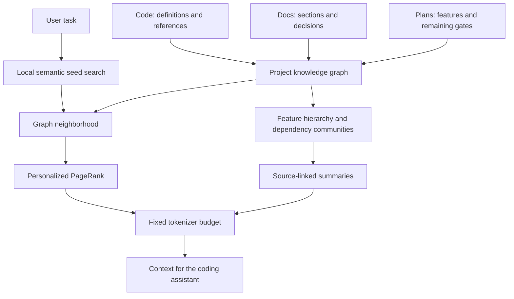

# Project knowledge graph

The knowledge tooling connects the working code, documentation and roadmap. It runs outside the music application and sends no project text to a hosted service.

The design follows [Aider's repository map](https://aider.chat/docs/repomap.html): Tree-sitter extracts definitions and references, a personalized PageRank selects relevant context, and the output fits a fixed token budget. Feature summaries borrow the hierarchical context approach from [GraphRAG's indexing pipeline](https://microsoft.github.io/graphrag/index/default_dataflow/). This is a small local implementation, not a dependency on either product.

## Boundaries

- Code links are syntax-derived. Resolved imports identify definition targets; unresolved or ambiguous references remain explicit rather than claiming type-checker precision.
- Editorial feature summaries carry the behavioral invariants and current boundaries. Generated dependency subcommunities group connected implementation files and aggregate source evidence. This uses a maintained feature hierarchy rather than GraphRAG's LLM extraction and Leiden clustering.
- Semantic seeds use a local sentence embedding model. A separately selected lexical mode is available for offline installations without that model; it is labeled as lexical.
- Context is measured with the named tokenizer, including headings and citations. A fixed budget applies to the complete returned context, not just snippets. This tokenizer is a documented approximation of a consumer using a different model vocabulary.
- Generated indexes use content hashes and schema/model versions. Queries rebuild stale graph data, and summaries are checked against the working files. Cached model files, embeddings and graph data are ignored by Git.

The tracked feature catalog and generated project map provide the durable documentation; the graph and semantic vectors are derived artifacts.

## Sources

Tree-sitter uses [Microsoft's packaged WASM runtime and grammars](https://github.com/microsoft/vscode-tree-sitter-wasm). Semantic inference uses [Transformers.js feature extraction](https://huggingface.co/docs/transformers.js/api/pipelines) with mean pooling and normalized embeddings. Token accounting uses the local `js-tiktoken` implementation of [tiktoken](https://github.com/dqbd/tiktoken).
